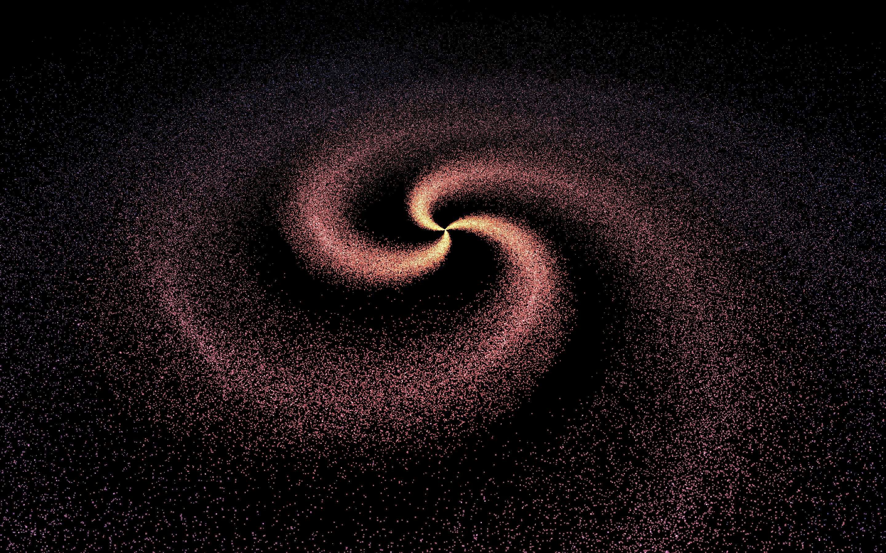

# 🌌 Three.js – Générateur de Galaxie 🌀

Une scène 3D interactive de galaxie créée avec [Three.js](https://threejs.org/), inspirée du parcours Three.js Journey par Bruno Simon.



## 🚀 Démo

[Voir la démo](https://rekuiem84.github.io/galaxy-generator/)

## ✨ Fonctionnalités

- Génération d'une galaxie avec des particules paramétrable
- Contrôle du nombre de particules, taille, rayon, nombre de bras de la galaxie, rotation des bras, couleurs, etc.
- Visibilité du trou noir central et contrôle de sa taille
- Contrôles de caméra libre (OrbitControls)
- Interface de debug (lil-gui) pour ajuster tous les paramètres en temps réel

## 🛠️ Installation & Lancement

1. **Cloner le dépôt :**

   ```bash
   git clone https://github.com/Rekuiem84/galaxy-generator
   cd galaxy-generator
   ```

2. **Installer les dépendances :**

   ```bash
   npm install
   ```

3. **Lancer le serveur :**

   ```bash
   npm run dev
   ```

4. **Build pour la production :**

   ```bash
   npm run build
   ```

   Les fichiers optimisés seront générés dans le dossier `dist/`.

## 📁 Structure du projet

```
├── src/           # Fichiers sources
├── dist/          # Fichiers générés pour la production
├── package.json   # Dépendances et scripts
└── vite.config.js # Configuration Vite
```

## 🎛️ Paramètres ajustables (via le menu debug)

- Nombre de particules
- Taille des particules
- Rayon de la galaxie
- Nombre de bras
- Rotation des bras, "quantité de spirale"
- Diamètre des bras de la galaxie
- Coefficient de regroupement au centre des bras
- Couleur intérieure et extérieure
- Visibilité et taille du trou noir central

## 🔗 Mes autres projets Three.js

- [Repo Three.js Journey principal](https://github.com/Rekuiem84/threejs-journey) — pour retrouver tous mes projets suivant ce parcours
